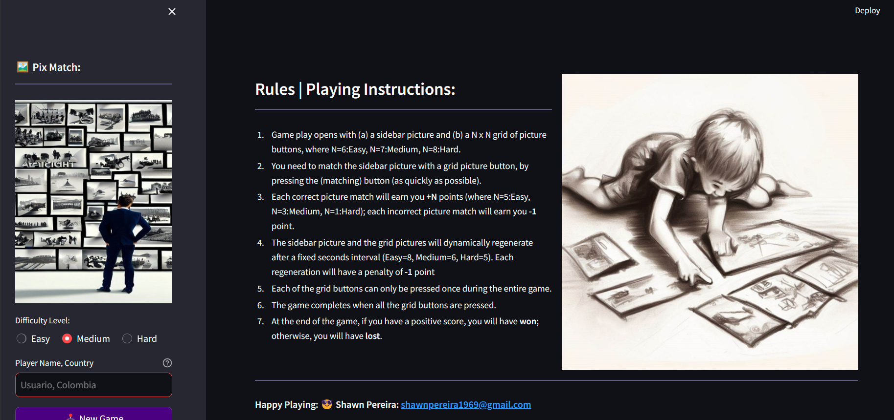

# Fragmentos librerias Especiales


## Bibliotecas Necesarias

---

### 1. Streamlit

El proyecto utiliza la biblioteca de Python llamada Streamlit. Streamlit permite renderizar componentes HTML de alto nivel de manera sencilla, facilitando la creación de aplicaciones web interactivas y dinámicas.

 ```python
    st.caption('')
    st.markdown(horizontal_bar, True)

    if len(mystate.expired_cells) == (total_cells_per_row_or_col ** 2):
        Leaderboard('write')

        if mystate.myscore > 0: st.balloons()
        elif mystate.myscore <= 0: st.snow()

        tm.sleep(5)
        mystate.runpage = Main
        st.rerun()
```
---

### 2. OS (Sistema Operativo)

Se importa esta librería para poder acceder a rutas de nuestros directorios, por ejemplo para acceder a las imágenes, archivos externos como el JSON donde se guardan los usuarios con sus respectivos puntajes. En general, es necesaria para adquirir funciones nativas del sistema operativo.
<span style="font-size: 0.6em;">Nota: Este es un ejemplo de uso de la libreria en el proyecto.</span>

 ```python
    import os

    # Acceder al directorio actual y listar todos los archivos JSON
    current_directory = os.getcwd()
    json_files = [f for f in os.listdir(current_directory) if f.endswith('.json')]

```

---

### 3. Time

La biblioteca Time proporciona funciones relacionadas con el tiempo, como la obtención de la hora actual o la introducción de retardos en la ejecución del código. En este proyecto, puede ser utilizada para implementar funcionalidades basadas en el tiempo, como temporizadores o cronogramas.

<span style="font-size: 0.6em;">Nota: Este es un ejemplo de uso de la libreria en el proyecto.</span>

 ```python
    st.caption('')
    st.markdown(horizontal_bar, True)

    if len(mystate.expired_cells) == (total_cells_per_row_or_col ** 2):
        Leaderboard('write')

        if mystate.myscore > 0: st.balloons()
        elif mystate.myscore <= 0: st.snow()

        tm.sleep(5)
        mystate.runpage = Main
        st.rerun()
```

---

### 4. Base64

La biblioteca Base64 se utiliza para realizar operaciones de codificación y decodificación en formato Base64. Esto puede ser útil para convertir datos binarios en una representación de texto que sea segura para su transporte a través de canales que solo admiten texto.

 ```python
    st.caption('')
    st.markdown(horizontal_bar, True)

    if len(mystate.expired_cells) == (total_cells_per_row_or_col ** 2):
        Leaderboard('write')

        if mystate.myscore > 0: st.balloons()
        elif mystate.myscore <= 0: st.snow()

        tm.sleep(5)
        mystate.runpage = Main
        st.rerun()
```

---

### 5. JSON

La biblioteca JSON se utiliza para trabajar con archivos en formato JSON. En este proyecto, puede ser utilizada para leer y escribir datos en archivos JSON, lo que permite almacenar y recuperar información estructurada de forma sencilla y fácil de interpretar.

 ```python
    st.caption('')
    st.markdown(horizontal_bar, True)

    if len(mystate.expired_cells) == (total_cells_per_row_or_col ** 2):
        Leaderboard('write')

        if mystate.myscore > 0: st.balloons()
        elif mystate.myscore <= 0: st.snow()

        tm.sleep(5)
        mystate.runpage = Main
        st.rerun()
```

---

### 6. PIL (Python Imaging Library)

PIL, también conocida como Pillow, es una biblioteca de procesamiento de imágenes en Python. Se utiliza para cargar, manipular y guardar imágenes en varios formatos de archivo. En este proyecto, puede ser utilizada para trabajar con imágenes, como cargar y mostrar imágenes en la interfaz de usuario.

---

### 7. Streamlit (Autorefresh)

Streamlit proporciona la capacidad de actualizar automáticamente la interfaz de usuario sin necesidad de recargar la página. Esta funcionalidad puede ser útil para mantener actualizada la interfaz de usuario con datos en tiempo real o para refrescar los elementos visuales de la aplicación de forma dinámica. Esto es necesario para actualizar los emojis que muestra al usuario constantemente, mejorando la eficiencia de carga del sitio.

---
